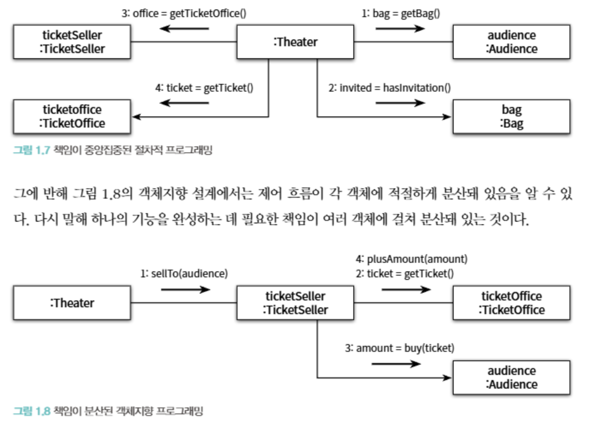

- 객체 지향 프로그램을 설계하고 유지보수하는 데 필요한 원칙과 기법을 소개하기 위해 쓰여진 책

# 1장

### 소프트웨어 모듈 필요조건

1. 제대로 동작하는 것
2. 변경을 위해 존재하는 것
3. 코드를 읽는 사람과 소통하는 것 (`이해 가능한 코드`)

## 이해 가능한 코드

- 객체는 능동적인 존재여야한다
  - 관람객과 판매원이 소극장의 통제를 받는 수동적인 존재임이 문제로 지적됨
  - 판매원의 입장에서, 매표소에 가만히 안자 티켓이 하나씩 사라지고 돈이 저절로 쌓이는 광경을 만드는 코드는 잘못됨
- 최소한의 책임을 부여해야한다.
  - 하나의 클래스나 하나의 메서드에 많은 세부사항을 부여하는 것은 코드를 읽고 이해하는데 부정적인 영향을 끼침

## 변경에 취약한 코드

- 정보가 객체에 응집되어있지 않고, 다른 객체에게 많이 노출된 코드
- 의존성이 없을수록 변경에 용이하지만, 객체지향 특성상 의존성을 완전히 제거할 수는 없음
  - 객체지향 설계는 서로 의존하면서 협력하는 객체들의 공동체를 구성하는 것이기 때문

## 티켓 판매 어플리케이션 지적 사항

`문제`

- Audience의 Bag과 TicketSeller의 TicketOffice가 Theater 노출되어 있기 때문에 변경이 어려움

`해결방안`

- Audience와 TicketSeller에게 자율성을 부여하여 각자가 Bag과 TicketOffice를 처리하도록 설계 변경 **(자울성을 부여)**
- Theater가 TicketOffice에 대해 하던 작업을 TicketSeller에게 부여함으로써 자율성을 높임

`결과`

- 자율성을 높이니 객체가 능동적으로 동작하게 되어 이해가능한 코드로 변함
- 자율성을 높이니 객체에게 책임이 응집되어, 변경에 용이한 코드로 변함
- Theater에게 과중된 책임이 흩어짐
  

## 객체지향

- 객체지향의 목적은 스스로 책임을 수행하는 자율적인 객체들의 공동체를 구성하는 것
  - 책임을 어떻게 부여할 것인지가 제일 중요함
  - 데이터와 프로세스가 같은 객체에 위치해야함
- 현실에서 수동적인 존재더라도, 객체 지향의 세계에서는 능동적이고 자율적인 존재로 여겨야함 (의인화)
- 자율성과 결합도는 트레이드오프 관계이며, 적절한 균형을 지켜야함
