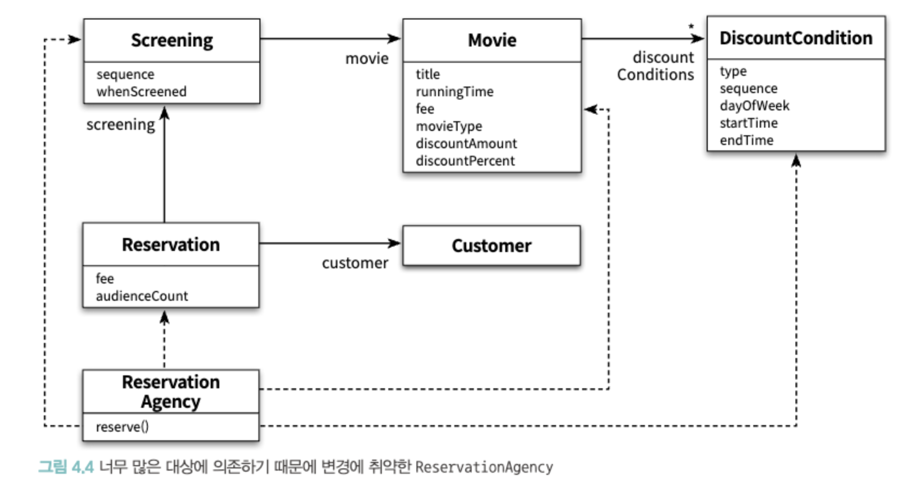
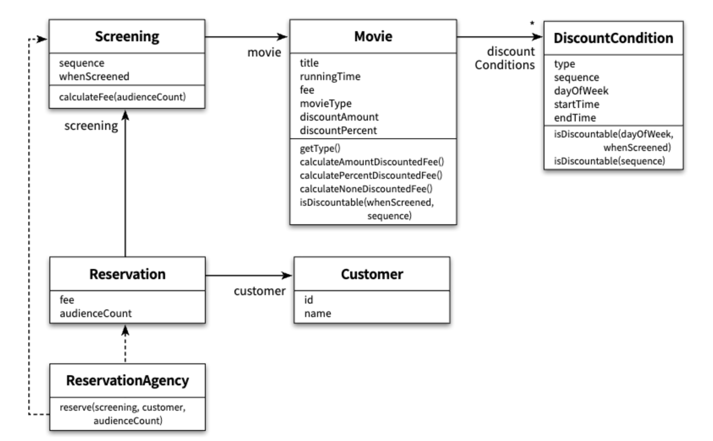

캡슐화
- 변경 가능성이 큰 부분은 내부에 숨기고, 변경 가능성이 적은 부분은 외부로 노출 시키는 것
- 변경 가능성이 큰 부분은 `구현체` 변경 가능성이 적은 부분은 `인터페이스`

응집도
- 모듈에 포함된 내부 요소들이 연관돼 있는 정도를 의미
- 모듈 내 요소들이 하나의 목적을 위해 긴밀하게 협력한다면 그 모듈은 높은 응집도를 가짐
- 서로 다른 이유로 변경되는 코드가 하나의 모듈에 공존할 때 모듈의 응집도가 낮아짐

결합도
- 의존성의 정도를 나타내며 다른 모듈에 대해 얼마나 많은 지식을 갖고 있는지를 나태나는 척도


- 데이터 객체들을 사용하는 제어 로직이 특정 객체롤 집중되어 하나의 제어 객체가 다른 요소에 강하게 결합되는 문제 발생
- 이런 문제는 캡슐화를 위반했기 때문에 발생함. 즉,캡슐화는 설계의 제 1원리

캡슐화를 지키는 방법
- 객체 내부의 데이터는 외부로 노출시키지말고 내부 데이터를 활용하는 책임을 부여하고 해당 책임을 퍼블릭 메서드로 활용. 이때 말하는 메서드는 데이터에 단순히 접근하는 Getter/Setter 제외
- 객체는 자신의 데이터에 대해 스스로 책임져야함

스스로 자신의 데이터를 책임지는 객체
- 아래 2가지 기준을 생각해야함
    - 이 객체가 어떤 데이터를 포함해야하는가?
    - 이 객체가 데이터에 대해 수행해야하는 오퍼레이션은 무엇인가?


- 데이터를 처리하는데 필요한 메서드를 객체가 스스로 구현하고 있음

```java
public class DiscountCondition {
    private DiscountConditionType type;
    private int sequence;
    private DayOfWeek dayOfWeek;
    private LocalTime startTime;
    private LocalTime endTime;

    public DiscountConditionType getType(){
        return type;
    }

    public boolean isDiscountable(DayOfWeek dayOfWeek, LocalTime time) {
        return this.dayOfWeek.equals(dayOfWeek) &&
            this.startTime.compareTo(time) <= 0 &&
            this.endTime.compareTo(time) >= 0;
    }

    public boolean isDiscountable(int sequence) {
        if (type != DiscountConditionType.SEQUENCE) {
          throw new IllegalArgumentException();
        }
        
        return this.sequence == sequence;
    }
}
```
- #isDiscountable의 시그니처를 통해 내부에 어떤 데이터가 있는지 노출되고 있음 (문제)
- 속성을 변경하려고 할 때, 파급효과가 생김


```java
public class Movie {
    private String title;
    private Duration runningTime;
    private Money fee;
    private List<DiscountCondition> discountConditions;

    private MovieType movieType;
    private Money discountAmount;
    private double discountPercent;

    public MovieType getMovieType() {
        return movieType;
    }

    public Money calculateAmountDiscountedFee() {
        if (movieType != MovieType.AMOUNT_DISCOUNT) {
            throw new IllegalArgumentException();
        }
        return fee.minus(discountAmount);
    }

    public Money calculatePercentDiscountedFee() {
        if (movieType != MovieType.PERCENT_DISCOUNT) {
            throw new IllegalArgumentException();
        }
        return fee.minus(fee.times(discountPercent));
    }

    public Money calculateNoneDiscountedFee() {
        if (movieType != MovieType.NONE_DISCOUNT) {
            throw new IllegalArgumentException();
        }
        return fee;
    }

    public boolean isDiscountable(LocalDateTime whenScreened, int sequence) {
        for (DiscountCondition condition: discountConditions) {
            if (condition.getType() == DiscountConditionType.PERIOD){
                if (condition.isDiscountable(whenScreend.getDayOfWeek(), whenScreened.toLocalTime())) {
                    return true;
                }
            } else {
                if (condition.isDiscountable(sequence)) {
                    return true;
                }
            }
        }

        return false;
    }
}       
```
- 시그니처를 통해 내부 데이터를 노출시키고 있지는 않지만, 메서드 명으로 노출 시키고 있음 (문제)


```java
public class Screening {
    private Movie movie;
    private int sequence;
    private LocalDateTime whenScreened;

    public Screening(Movie movie, int sequence, LocalDateTime whenScreened) {
        this.movie = movie;
        this.sequence = sequence;
        this.whenScreened = whenScreened;
    }

    public Money calculateFee(int audienceCount) {
        switch (movie.getMovieType()) {
            case AMOUNT_DISCOUNT:
                if (movie.isDiscountable(whenScreened, sequence)) {
                    return movie.calculateAmountDiscountedFee().times(audienceCount);
                }
                break;

            case PERCENT_DISCOUNT:
                if (movie.isDiscountable(whenScreened, sequence)) {
                    return movie.calculatePercentDiscountedFee().times(audienceCount);
                }
                break;

            case NONE_DISCOUNT:
                return movie.calculateNoneDiscountedFee().times(audienceCount);
    }
    
    return movie.calculateNoneDiscountedFee().times(audienceCount);
    }
}
```

```java
public class ReservationAgency {
    public Resevation reserve(Screening screening, Customer customer, int audienceCount) {
        Money fee = screening.calculateFee(audienceCount);
        return new Reservation(customer, screening, fee, audienceCount);
    }
}
```

데이터 중심 설계의 문제점
- 위의 코드들이 문제를 가지는 이유는, 캡슐화를 위반했기 때문이며 데이터 중심 설계의 문제점은 다음과 같음
    - 데이터 중심의 설계는 너무 이른 시기에 데이터에 관해 결정하도록 강요
        - 데이터를 먼저 결정하고 오퍼레이션을 나중에 결정한는 방식은, 데이터에 관한 지식이 객체의 인터페이스에 고스란히 드러나게됨
    - 데이터 중심의 설계는 협력이라는 문맥을 고려하지 않고 객체를 고립시킨 채 오퍼레이션을 결정
        - 협력을 고려하지 못하기 때문에 문제