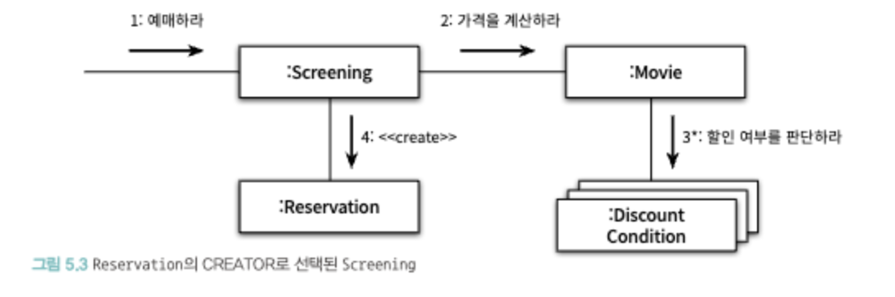
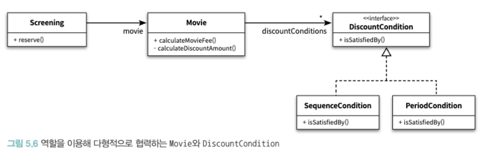
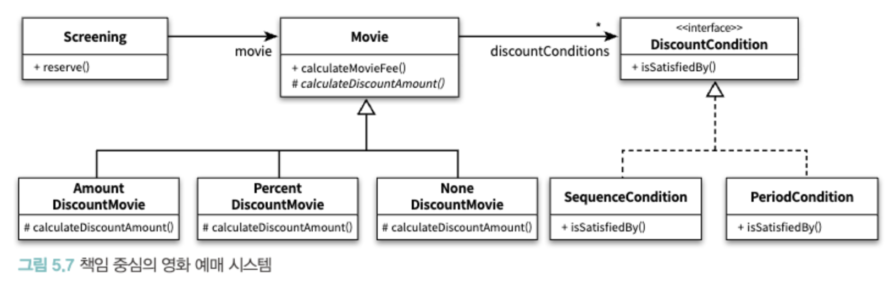

### 설계의 트레이드 오프
- 동일한 기능을 하는 설계는 무수히 많음.
- 책임을 할당할 수 있는 다양한 대안들이 존재한다면, 높은 응집도와 낮은 결합도를 얻을 수 있는 설계를 선택

### 창조자에게 객체 생성 책임을 할당하라
- 영화 예애 협력의 최종 결과는 Reservation 인스턴스이며, 협력 과정에서 Reservatoin이 생성되어여하며 생성 책임을 누군가한테는 할당해야함
- CREATOR 패턴에 의하면 생성되는 객체와 가장 밀접한 객체에게 생성 책임을 할당하는 것이 좋음
    - 가장 밀접한 객체는 결합되어있는 상태이고, 이미 결홥돼 있는 객체에게 생성 책임을 할당하는 것은 설계의 전반적인 결합도에 영향을 미치지 않음

### 영화 예매 시스템 책임할당

- 애플리케이션이 제공해야하는 기능을 애플리케이션의 책임으로 생각
- 해당 책임을 애플리케이션에 대해 전송된 메시지로 간주하고 메시지를 책임일 첫 번째 객체를 선택하는 것으로 설계를 시작
- 예매하라는 메시지를 수신할 객체로 Screening이 선택됨
    - Screening이라는 도메인 개념은 영화에 대한 정보와 상영 시간, 상영 순번 과 같은 예매에 필요한 다양한 정보를 알고 있기 때문. (Information Expert)
- Screening이 메시지를 수행하는데 스스로 처리할 수 있는 작업과 그렇지 못한 작업을 분류
    - 스스로 처리할 수 없는 작업이 있다면 외부에 도움을 요청
    - Screening은 영화 가격에 대한 정보가 없기 때문에 가격을 계산하지 못함
- Screening은 영화 가격을 알고 있는 Movie에게 가격을 계산하라는 메시지를 전달
- Movie는 요금을 계산할 떄 할인여부를 판단해야하는데, 할인과 관련된 정보가 DiscountCondition으로 묶어 DiscountCondition에 메시지 전달
- Screening과 Reservation이 가장 밀접하기 때문에 Screeing에서 Reservation을 생성

### 코드 구현
- Screeing에서 Movie로 요금을 계산하라는 메시지를 보낼 떄, Screening이 Movie의 내부 구현에 대한 어떤 지식도 없이 존송할 메시지를 결정했음.
    - 수신자의 내부 구현을 고려하지 않고 필요한 메시지를 결정하면 Movie의 내부 구현을 깔끔하게 캡슐화할 수 있음

`DiscountCondition`
```java
public class DiscountCondition {
  private DiscountConditionType type;
  private int sequence;
  private DayOfWeek dayOfWeek;
  private LocalTime startTime;
  private LocalTime endTime;

  public boolean isSatisfiedBy(Screening screening) {
    if (type == DiscountConditionType.PERIOD) {
      return isSatisfiedByPeriod(screening);
    }
    return isSatisfiedByPeriod(screening);
  }

  private boolean isSatisfiedByPeriod(Screening screening) {
    return dayOfWeek.equals(screening.getWhenScreened().getDayOfWeek())
            && startTime.isBefore(screening.getWhenScreened().toLocalTime())
            && endTime.isAfter(screening.getWhenScreened().toLocalTime());
  }

  private boolean isSatisfiedBySequence(Screening screening) {
    return sequence == screening.getSequence();
  }
```
- DiscountCondition은 변경 취약점 3가지를 가지고 있음
    - 1. 새로운 할인 조건 추가
    - 2. 순번 조건을 판단하는 로직 변경
    - 3. 기간 조건을 판단하는 로직 변경
- 순번 조건이 변경되어 코드에 영향을 미치는 시점과 기간 조건이 변경되어 코드에 영향을 미치는 시점이 다를 수 있는데, 이는 DiscountCondition이 서로 다른 이유로, 서로 다른 시점에 변경될 확률이 높음을 의미함. 이는 응집도가 낮다는 것을 의미.
- 변경의 이유를 근거로 객체를 개선하는 작업이 중요.
    - 1. 클래스가 하나 이상의 이유로 변경돼야 한다면 응집도가 낮음

    - 2. 응집도가 낮은 클래스는 인스턴스를 생성할 때, 객체의 속성중 일부만 초기화하고 일부는 초기화되지 않은 상태로 남겨둠
         - DiscountCondition에서는 sequence가 초기화 될 떄, dayOfWeek, startTime, endTime은 초기화 되지 않음

    - 3. 메서드들이 사용하는 속성에 따라 그룹이 나뉜다면 클래스의 응집도가 낮음
            - DiscoundCondition#isSatisfiedBySequence와 DiscoundCondition#isSatisfiedByPeriod 메서드 경우 이에 해당함



`Movie`
- MovieType으로 금액 할인 정책 영화와 비율 할인 정책 영화 2가지 타입을 하나의 클래스 안에서 구현하고 있음
- 하나 이상의 이유로 변경될 수 있으며, 응집도가 낟음
- POLYMORPHISM 패턴을 사용해서 서로 다른 행동을 타입별로 분리

```java
import java.time.Duration;
import java.util.Arrays;
import java.util.List;

public abstract class Movie {
    private String title;
    private Duration runningTime;
    private Money fee;
    private List<DiscountCondition> discountConditions;

    public Movie(String title, Duration runningTime, Money fee, DiscountCondition... discountConditions) {
        this.title = title;
        this.runningTime = runningTime;
        this.fee = fee;
        this.discountConditions = Arrays.asList(discountConditions);
    }

    public Money calculateMovieFee(Screening screening) {
        if (isDiscountable(screening)) {
            return fee.minus(calculateDiscountAmount());
        }
        return fee;
    }

    private boolean isDiscountable(Screening screening) {
        return discountConditions.stream()
                .anyMatch(condition -> condition.isSatisfiedBy(screening));
    }

    protected abstract Money calculateDiscountAmount();

    protected Money getFee(){
        return fee;
    }
}
```

```java
public class AmountDiscountMovie extends Movie {
    private Money discountAmount;

    public AmountDiscountMovie(String title, Duration runningTime, Money fee,
                                Money discountAmount, DiscountCondition... discountConditions) {
        super(title, runningTime, fee, discountConditions);
        this.discountAmount = discountAmount;
    }

    @Override
    protected Money calculateDiscountAmount() {
        return discountAmount;
    }
}

public class PercentDiscountMovie extends Movie {
  private double percent;

  public PercentDiscountMovie(
          String title, Duration runningTime, Money fee, double percent, DiscountCondition... discountConditions) {
    super(title, runningTime, fee, discountConditions);
    this.percent = percent;
  }

  @Override
  protected Money calculateDiscountAmount() {
    return getFee().times(percent);
  }
}

public class NoneDiscountMovie extends Movie {
  public NoneDiscountMovie(String title, Duration runningTime, Money fee) {
    super(title, runningTime, fee);
  }

  @Override
  protected Money calculateDiscountAmount() {
    return Money.ZERO;
  }
}
```




### 물음표

```java

private Money calculateFee(int audienceCount) {
    return movie.calculateMovieFee(this).times()
}
```
- 수신자의 내부 구현을 고려하지 않고 필요한 메시지를 결정하면 Movie의 내부 구현을 깔끔하게 캡슐화할 수 있다는 장점이 있지만 movie에게 필요도 없는 정보를 더 많이 제공하고 있지는 않은가 ?
